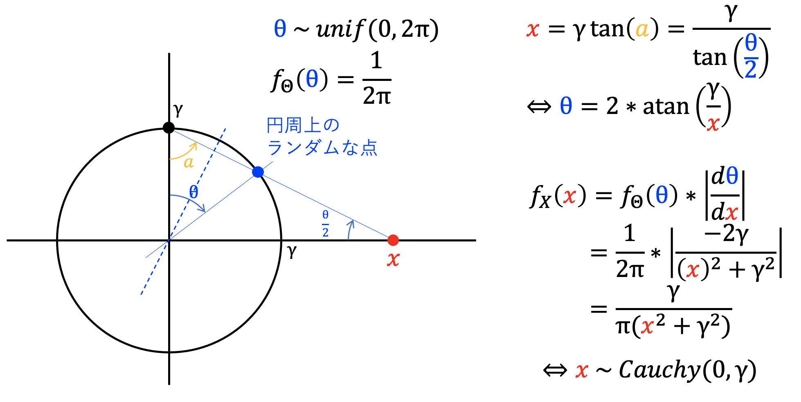
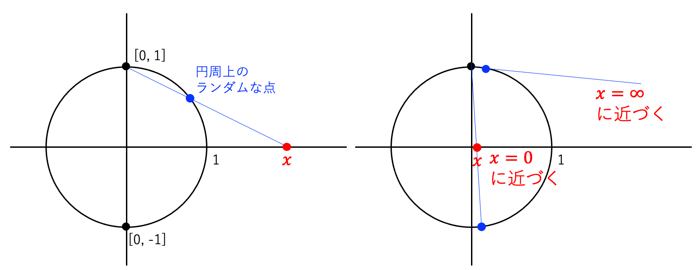
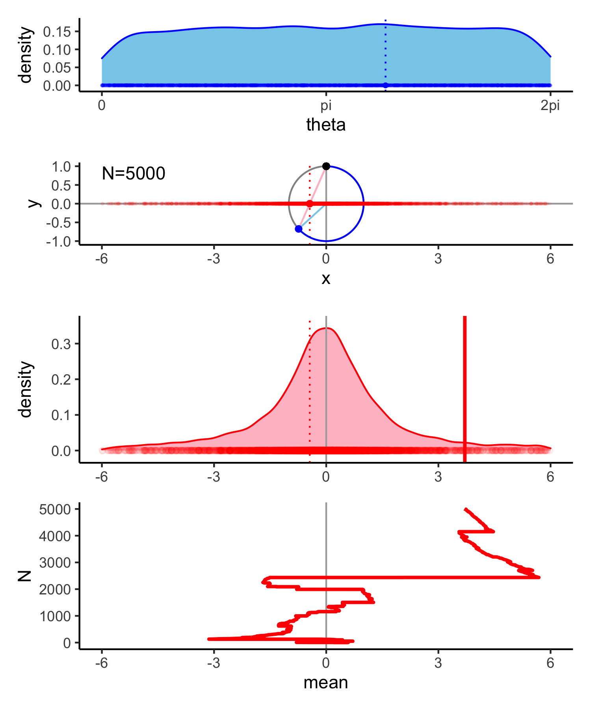
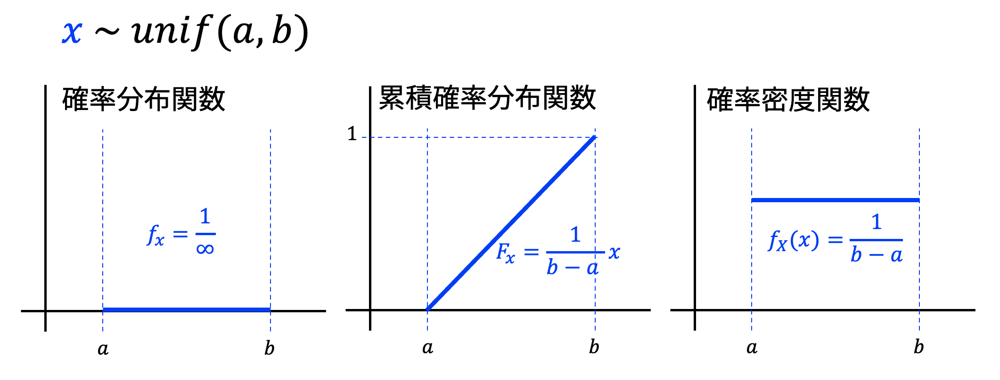
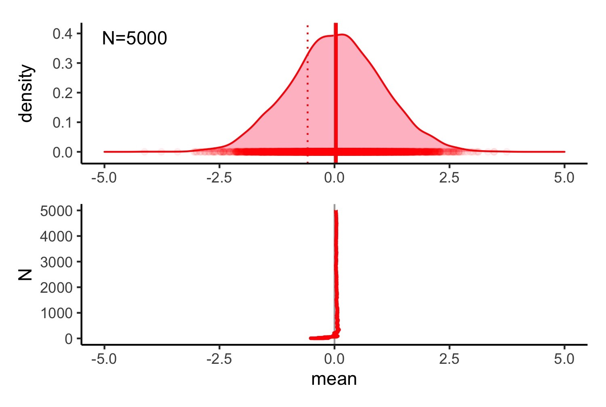

概念



平均が収束しない理由: ゼロに近づくのと同じ程度、∞に近づくから




ライブラリ読み込み


```r
library(tidyverse)
library(patchwork)
```

サンプリング


```r
set.seed(71)

N <- 5000

df_cauchy <-
  tibble(N = 1:N,
         theta = runif(N, 0, 2 * pi)) %>%
  mutate(val = 1 / tan(theta / 2)) %>% 
  mutate(mean = cumsum(val) / N) %>% 
  mutate(x = sin(theta),
         y = cos(theta)) %>% 
  mutate(xend = 0,
         yend = 1)
```

単位円描画用のデータフレーム(θの取り方の問題でx,yはあえて逆にしてある)


```r
en <-
  tibble(theta = seq(0, 2 * pi, length = 1000)) %>% 
  mutate(y = cos(theta),
         x = sin(theta))
```

描画


```r
.alpha <- 0.05  # あれこれの透明度
.l <- 6         # 軸範囲（±）

i <- 5000　　　 # 描画するサンプル番号

# フィルタ
dat_i <-
  df_cauchy %>% 
  filter(N <= i)

dat_tail <-
  df_cauchy %>% 
  filter(N == i)

# 単位円と3点の描画
g_plot <-
  dat_i %>% 
  ggplot() +
  aes(x = x, y = y) +
  geom_hline(yintercept = 0, color = "darkgrey") +
  geom_vline(xintercept = 0, color = "darkgrey") +
  geom_vline(data = dat_tail,
             aes(xintercept = val), 
             color = "red", linetype = "dotted") +
  geom_path(data = en,
            alpha  = 0.5) +
  geom_path(data = en %>% filter(theta <= df_cauchy$theta[i]),
            color = "blue", size = 0.5) +
  geom_segment(data = dat_tail,
               yend = 0, xend = 0, 
               color = "skyblue") +
  geom_segment(data = dat_tail,
               yend = 1, xend = 0, 
               color = "pink") +
  geom_segment(data = dat_tail,
               aes(x = x / abs(x) * .l, 
                   y = 1 - (1 - y) / abs(x) * .l),
               yend = 1, xend = 0, 
               color = "pink") +
  geom_segment(data = dat_tail,
               aes(x = val),
               y = 0, yend = 1, xend = 0, 
               color = "pink") +
  geom_point(x = 0, y = 1) +
  geom_point(aes(x = val, y = 0), 
             color = "red", alpha = .alpha, size = 0.5) +
  geom_point(data = dat_tail,
             color = "blue") +
  geom_point(data = dat_tail,
             aes(x = val, y = 0), 
             color = "red", size = 1.5) +
  geom_text(data = dat_tail,
            aes(label = str_c("N=", N)),
            x = -.l, y = 1, hjust = 0, vjust = 1) +
  scale_x_continuous(limits = c(-.l, .l)) +
  scale_y_continuous(limits = c(-1, 1)) +
  theme_classic() +
  coord_fixed()

# thetaの確率密度分布
g_dens_u <-
  dat_i %>% 
  ggplot() +
  aes(x = theta) +
  geom_density(color = "blue", fill = "skyblue") +
  geom_vline(data = dat_tail,
             aes(xintercept = theta),
             color = "blue", linetype = "dotted") +
  geom_point(y = 0, color = "blue", alpha = .alpha, size = 0.5) +
  geom_point(data = dat_tail,
             y = 0, color = "blue", size = 1) +
  scale_x_continuous(limits = c(0, 2 * pi),
                     breaks = c(0, pi, 2 * pi),
                     labels = c("0", "pi", "2pi")) +
  scale_y_continuous(limits = c(0, NA),
                     expand = c(0.1, 0)) +
  theme_classic() +
  xlab("theta") +
  ylab("density")

# xの確率密度分布
g_dens <-
  dat_i %>% 
  ggplot() +
  aes(x = val) +
  geom_density(color = "red", fill = "pink") +
  geom_vline(xintercept = 0, color = "darkgrey") +
  geom_point(y = 0, color = "red", alpha = .alpha) +
  geom_vline(data = dat_tail,
             aes(xintercept = val),
             color = "red", linetype = "dotted") +
  geom_vline(data = dat_tail,
             aes(xintercept = mean),
             color = "red", size = 1) +
  scale_x_continuous(limits = c(-.l, .l)) +
  scale_y_continuous(limits = c(0, NA),
                     expand = c(0.1, 0)) +
  theme_classic() +
  theme(axis.title.x = element_blank()) +
  ylab("density")

# xの平均の推移
g_mean <-
  dat_i %>% 
  ggplot() +
  aes(x = mean, y = N) +
  geom_vline(xintercept = 0, color = "darkgrey") +
  geom_path(color = "red", size = 1) +
  scale_x_continuous(limits = c(-.l, .l)) +
  theme_classic()
```

図の合成


```r
g <-
  wrap_plots(g_dens_u, g_plot, g_dens, g_mean,
             heights = c(0.5, 0.7, 1, 1))
```

保存


```r
ggsave("fig/cauchydist.png", g, width = 5, height = 6)
```




補足: 確率密度関数



補足: 正規分布の平均はすぐに収束



補足： 動作環境

```
R version 4.0.3 (2020-10-10)
Platform: x86_64-apple-darwin17.0 (64-bit)
Running under: macOS Big Sur 10.16

 [1] patchwork_1.1.0
 [2] forcats_0.5.0  
 [3] stringr_1.4.0  
 [4] dplyr_1.0.2    
 [5] purrr_0.3.4    
 [6] readr_1.4.0    
 [7] tidyr_1.1.2    
 [8] tibble_3.0.4   
 [9] ggplot2_3.3.5  
[10] tidyverse_1.3.0
```
